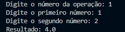

# Relatório de Bugs — Calculadora Científica

Este documento lista todos os bugs encontrados no arquivo `Calculadora.py`

---

## Sumário

1. [Função "adicao" adicionando o primeiro número 2x](#1---função-adicao-adicionando-o-primeiro-número-2x)  
2. [Função "fatorial" retornando 0 para qualquer número](#2---função-fatorial-retornando-0-para-qualquer-número)  
3. [Função "logaritmo_natural" usa método inexistente `np.ln`](#3---função-logaritmo_natural-usa-método-inexistente-npln)  
4. [Função "logaritmo_base10" chama o logaritmo errado](#4---função-logaritmo_base10-chama-o-logaritmo-errado)  
5. [Funções trigonométricas não implementadas](#5---funções-trigonométricas-não-implementadas)  
6. [Opção "10" (Seno) aparece no menu mas não funciona](#6---opção-10-seno-aparece-no-menu-mas-não-funciona)  
7. [Falta de tratamento para divisão por zero](#7---falta-de-tratamento-para-divisão-por-zero)  
8. [Mensagem de erro incorreta em `logaritmo_base10`](#8---mensagem-de-erro-incorreta-em-logaritmo_base10)

---

## 1 - Função "adicao" adicionando o primeiro número 2x

Localização: Linha 4 de `Calculadora.py`  

Descrição:  
Ao fazer a soma dos números, a função "adicao" está fazendo a soma do primeiro número inserido pelo usuário 2(duas) vezes, ao invés de apenas 1(uma).

Contexto: Python 3.12.4 | Comando: `python Calculadora.py`

Passos para reproduzir:
1. Executar `python Calculadora.py`
2. Selecionar opção `1` (Adição)
3. Inserir `1`
4. Inserir `2`
5. Resultado exibido: `4.0`

Consistência: Sempre acontece.  

Resultado Esperado: 1 + 2 = 3  
Resultado Obtido: 1 + 2 = 4  

Evidência: 


Severidade: Alto  
Impacto: Erro em operação fundamental de adição.  

Trecho de código:
```python
def adicao(x, y):
    return x + np.add(x, y)
```

Data: 08/11/2025

Status: Não Resolvido

## 2 - Função "fatorial" retornando 0 para qualquer número

Localização: Linha 22 de Calculadora.py

Descrição:
A função fatorial retorna 0 para qualquer número maior que 0. Isso ocorre porque o loop começa em 0, fazendo fat ser multiplicado por 0 logo na primeira iteração.

Contexto: Python 3.12.4 | Comando: python Calculadora.py

Passos para reproduzir:

Executar python Calculadora.py

Selecionar opção 7

Inserir 5

Resultado: 0

Resultado Esperado: 5! = 120
Resultado Obtido: 0

Evidência:


Severidade: Alto
Impacto: O cálculo fatorial é inutilizável.

Trecho de código:

def fatorial(x):
    fat = 1
    for i in range(x+1):
        fat *= i
    return fat


Data: 08/11/2025
Status: Não Resolvido

## 3 - Função "logaritmo_natural" usa método inexistente np.ln

Localização: Linha 29 de Calculadora.py

Descrição:
A função usa np.ln(x), mas a biblioteca NumPy não possui este método. O correto é np.log(x).

Contexto: Python 3.12.4 | Comando: python Calculadora.py

Passos para reproduzir:

Executar python Calculadora.py

Selecionar opção 8

Inserir 10

Resultado: AttributeError: module 'numpy' has no attribute 'ln'

Resultado Esperado: ln(10) ≈ 2.302585
Resultado Obtido: AttributeError

Evidência:


Severidade: Alto
Impacto: Função quebra o programa e não executa.

Trecho de código:

def logaritmo_natural(x):
    if x <= 0:
        return "Erro: Logaritmo de número não positivo"
    return np.ln(x)


Data: 08/11/2025
Status: Não Resolvido