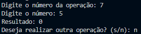
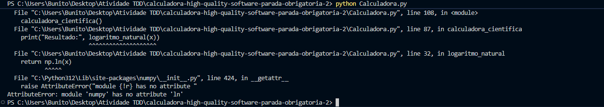
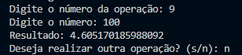
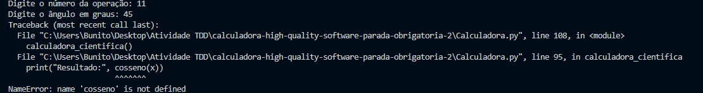
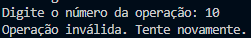
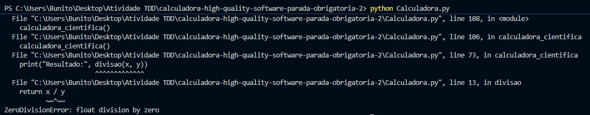
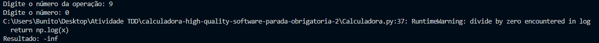

# Relatório de Bugs — Calculadora Científica

Este documento lista todos os bugs encontrados no arquivo `Calculadora.py`

---

## Sumário

1. [Função "adicao" adicionando o primeiro número 2x](#1---função-adicao-adicionando-o-primeiro-número-2x)  
2. [Função "fatorial" retornando 0 para qualquer número](#2---função-fatorial-retornando-0-para-qualquer-número)  
3. [Função "logaritmo_natural" usa método inexistente `np.ln`](#3---função-logaritmo_natural-usa-método-inexistente-npln)  
4. [Função "logaritmo_base10" chama o logaritmo errado](#4---função-logaritmo_base10-chama-o-logaritmo-errado)  
5. [Funções trigonométricas não implementadas](#5---funções-trigonométricas-não-implementadas)  
6. [Opção "10" (Seno) aparece no menu mas não funciona](#6---opção-10-seno-aparece-no-menu-mas-não-funciona)  
7. [Falta de tratamento para divisão por zero](#7---falta-de-tratamento-para-divisão-por-zero)  
8. [Mensagem de erro incorreta em `logaritmo_base10`](#8---mensagem-de-erro-incorreta-em-logaritmo_base10)

---

## 1 - Função "adicao" adicionando o primeiro número 2x

Localização: Linha 4 de `Calculadora.py`  

Descrição:  
Ao fazer a soma dos números, a função "adicao" está fazendo a soma do primeiro número inserido pelo usuário 2(duas) vezes, ao invés de apenas 1(uma).

Contexto: Python 3.12.4 | Comando: `python Calculadora.py`

Passos para reproduzir:
1. Executar `python Calculadora.py`
2. Selecionar opção `1` (Adição)
3. Inserir `1`
4. Inserir `2`
5. Resultado exibido: `4.0`

Consistência: Sempre acontece.  

Resultado Esperado: 1 + 2 = 3  
Resultado Obtido: 1 + 2 = 4  

Evidência: 


Severidade: Alto  
Impacto: Erro em operação fundamental de adição.  

Trecho de código:
```python
def adicao(x, y):
    return x + np.add(x, y)
```

Data: 08/11/2025

Status: Resolvido

## 2 - Função "fatorial" retornando 0 para qualquer número

Localização: Linha 22 de Calculadora.py

Descrição:
A função fatorial retorna 0 para qualquer número maior que 0. Isso ocorre porque o loop começa em 0, fazendo fat ser multiplicado por 0 logo na primeira iteração.

Contexto: Python 3.12.4 | Comando: python Calculadora.py

Passos para reproduzir:

Executar python Calculadora.py

Selecionar opção 7

Inserir 5

Resultado: 0

Resultado Esperado: 5! = 120
Resultado Obtido: 0

Evidência:



Severidade: Alto
Impacto: O cálculo fatorial é inutilizável.

Trecho de código:
```python
def fatorial(x):
    fat = 1
    for i in range(x+1):
        fat *= i
    return fat
```

Data: 08/11/2025
Status: Resolvido

## 3 - Função "logaritmo_natural" usa método inexistente np.ln

Localização: Linha 29 de Calculadora.py

Descrição:
A função usa np.ln(x), mas a biblioteca NumPy não possui este método. O correto é np.log(x).

Contexto: Python 3.12.4 | Comando: python Calculadora.py

Passos para reproduzir:

Executar python Calculadora.py

Selecionar opção 8

Inserir 10

Resultado: AttributeError: module 'numpy' has no attribute 'ln'

Resultado Esperado: ln(10) ≈ 2.302585
Resultado Obtido: AttributeError

Evidência:



Severidade: Alto
Impacto: Função quebra o programa e não executa.

Trecho de código:
```python
def logaritmo_natural(x):
    if x <= 0:
        return "Erro: Logaritmo de número não positivo"
    return np.ln(x)
```

Data: 08/11/2025
Status: Resolvido

## 4 - Função "logaritmo_base10" chama o logaritmo errado

Localização: Linha 34 de Calculadora.py

Descrição:
A função utiliza np.log(x) (logaritmo natural) em vez de np.log10(x).

Contexto: Python 3.12.4 | Comando: python Calculadora.py

Passos para reproduzir:

Executar python Calculadora.py

Selecionar opção 9

Inserir 100

Resultado: 4.605170185988092

Resultado Esperado: log10(100) = 2
Resultado Obtido: loge(100) ≈ 4.60517

Evidência:



Severidade: Médio
Impacto: Resultado incorreto em cálculos com base 10.

Trecho de código:
```python
def logaritmo_base10(x):
    if x < 0:
        return "Erro: Logaritmo de número não positivo"
    return np.log(x)
```

Data: 08/11/2025
Status: Resolvido

## 5 - Funções trigonométricas não implementadas

Localização: Linhas 46 a 64 de Calculadora.py

Descrição:
As funções cosseno(x) e tangente(x) são chamadas, mas não existem no código. O programa gera erro NameError.

Contexto: Python 3.12.4 | Comando: python Calculadora.py

Passos para reproduzir:

Executar python Calculadora.py

Selecionar opção 11

Inserir 45

Resultado: NameError: name 'cosseno' is not defined

Resultado Esperado: cos(45°) ≈ 0.7071
Resultado Obtido: NameError

Evidência:



Severidade: Alto
Impacto: As operações trigonométricas listadas no menu não funcionam.

Trecho de código:
```python
elif escolha == '11':
    x = float(input("Digite o ângulo em graus: "))
    print("Resultado:", cosseno(x))
```

Data: 08/11/2025
Status: Resolvido

## 6 - Opção "10" (Seno) aparece no menu mas não funciona

Localização: Linha 46 de Calculadora.py

Descrição:
O menu exibe a opção “10. Seno”, mas não há implementação correspondente. O programa retorna “Operação inválida”.

Contexto: Python 3.12.4 | Comando: python Calculadora.py

Passos para reproduzir:

Executar python Calculadora.py

Selecionar opção 10

Resultado: “Operação inválida. Tente novamente.”

Resultado Esperado: sin(x)
Resultado Obtido: “Operação inválida”

Evidência:



Severidade: Médio
Impacto: Função anunciada mas inexistente.

Data: 08/11/2025
Status: Resolvido

## 7 - Falta de tratamento para divisão por zero

Localização: Linha 13 de Calculadora.py

Descrição:
A função divisao não trata divisões por zero, gerando ZeroDivisionError.

Contexto: Python 3.12.4 | Comando: python Calculadora.py

Passos para reproduzir:

Executar python Calculadora.py

Selecionar opção 4

Inserir 10

Inserir 0

Resultado: ZeroDivisionError: float division by zero

Resultado Esperado: Mensagem “Erro: Divisão por zero”
Resultado Obtido: Exceção ZeroDivisionError

Evidência:



Severidade: Alto
Impacto: Quebra total da execução do programa.

Trecho de código:
```python
def divisao(x, y):
    return x / y
```

Data: 08/11/2025
Status: Resolvido

## 8 - Mensagem de erro incorreta em logaritmo_base10

Localização: Linha 33 de Calculadora.py

Descrição:
A função usa if x < 0, permitindo logaritmo de 0, o que resulta em -inf ao invés de uma mensagem de erro.

Contexto: Python 3.12.4 | Comando: python Calculadora.py

Passos para reproduzir:

Executar python Calculadora.py

Selecionar opção 9

Inserir 0

Resultado: -inf

Resultado Esperado: Mensagem “Erro: Logaritmo de número não positivo”
Resultado Obtido: -inf

Evidência:



Severidade: Baixo
Impacto: Inconsistência no tratamento de erros matemáticos.

Data: 08/11/2025
Status: Resolvido